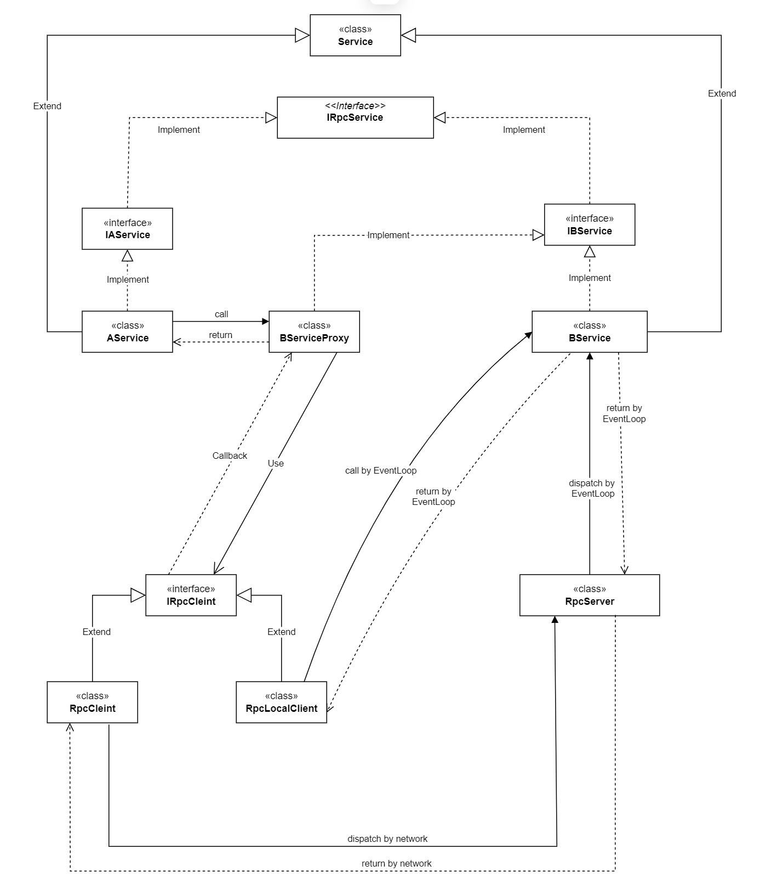
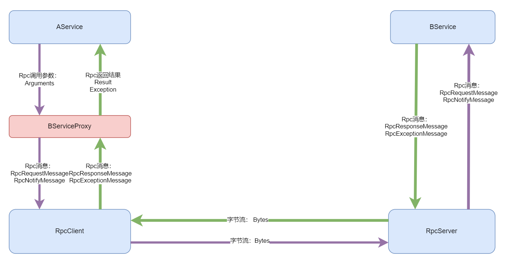

# cos

## 介绍

这是一个基于Actor模型的分布式服务器框架，其核心思想来自于skynet。

由于该库是个人空余时间所写，其中有一部分是为验证个人想法的试验性代码，目前还不具备一个完备框架所需要的所有组件，因此请不要将它用于商业用途。

目前已实现的功能如下。

### 基础库(CoLib)

1. 对象池(ObjectPools)：用于实现对象池化以减少GC压力。
2. 事件循环(EventLoop)：DotNetty的事件循环定制版，主要优化了事件循环的性能，增加池化任务。
3. 日志库(Loggin)：基于字符串模板实现的高性能低分配日志库，比Serilog的性能和内存分配有几倍的提升。
4. 序列化库(Serialize)：自有的Schemaless二进制格式，以及相应的序列化代码，由于序列化用代码生成的方式，因此性能很高，格式见[CoPack格式说明](CoPack格式说明.md)
5. 定时器(Timer)：基于优先队列和时间轮的定时器模块。
6. 分布式Id(UniqueId)：基于雪花算法，但没有时间回拨问题，用限速控制ID的分配频率。
7. 插件模块(Plugin)：基于AssemblyLoadContext的运行时插件加载机制。
8. 容器(Container): 各种高效低分配的容器类。

### 运行时(CoRuntime)

1. 运行时管理：日志和配置初始化，节点生命周期管理。
2. 服务框架：服务(Service)有自己的消息队列，服务之间是隔离的，只能通过RPC通讯。
3. RPC框架：通过代理类消除本地和远程的差异，使得服务之间可以用一致的方式通讯。
4. 内置服务：
    - 集群服务：用Consul作为服务发现。
    - 分布式Id服务。

下面是RPC的设计图，仅作参考：

